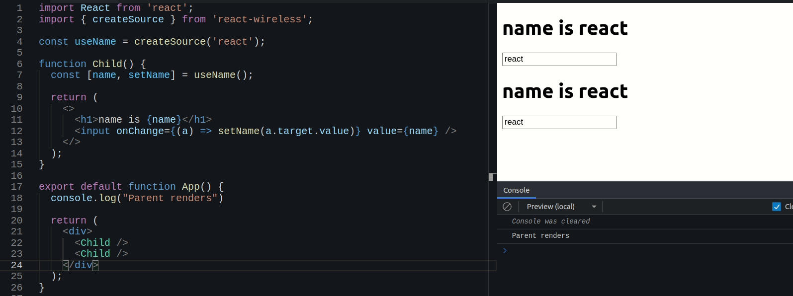

# react-wireless

**Lifting the state without parent rerender**




## Background

A while ago I stumbled upon Jack Herrington's video on [Blazing Fast React Context](https://www.youtube.com/watch?v=ZKlXqrcBx88&t=1496s) (I really highly recommend  watching it) and learn you can share state using Context _without the parent rerendering_.

Yesterday someone asked me "_Why do we need to provide the _value_ props to a Context's provider_?" and it got me wondered "_But we provided the value already in `createContext()`._". After some digging, it turns out the value from `createContext()` is used if no Provider exists.

I also have been wanting to publish an npm package.

## Installation

```bash
npm install react-wireless
```

## Usage

The source (or store or atom) lives outside the component.

```jsx
import { createSource } from 'react-wireless'

const useCount = createSource(0)
```

The returned value is a custom hook so I recommend prefixing with "use".

Use it inside your component as a regular useState (that is, it destructures into a state getter and setter).

```jsx
function NavBar() {
    const [count, setCount] = useCount()
}
```

Now any components that subscribes to useCount will rerender on state changes.

Oh, the setter also receives a callback just like useState's. Below is a contrived example of a counter app to illustrate the idea

```jsx
const useCount = createSource(0)

function IncrementButton() {
    const [_, setCount] = useCount()

    return <button onClick={() => setCount(c => c + 1)}>+1</button> 
}

function CountDisplay() {
    const [count] = useCount()

    return <span>{count}</span>
}

// this App will not rerender on count changes
function App() {
    return <>
        <CountDisplay />
        <IncrementButton />
    </>
}
```